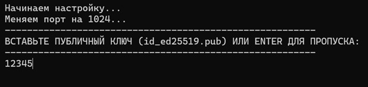
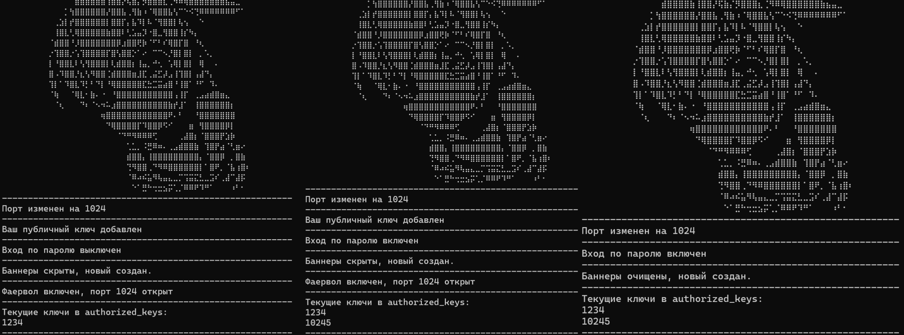

# Запуск

1. Зайти на сервер по SSH от имени **root**
2. Ввести команду
```bash
curl -sL "https://raw.githubusercontent.com/shinikakeru/Auto-Set-VPS/main/vps.sh?cache=$(date +%s)" > setup.sh && chmod +x setup.sh && sudo ./setup.sh
```
3. Добавить **ПУБЛИЧНЫЙ** ключ
4. Выбрать наличие пароля **(Только при добавленном ключе)**
5. Все остальное выполнится **автоматически**

## Изображения работы
<p align="center">
  
</p>

<p align="center">
  
</p>

<p align="center">
  
</p>


## Что делает скрипт

1. Меняет порт на 1024 для SSH в **/etc/ssh/sshd\_config**
2. Добавляет SSH ключ в **/root/.ssh/authorized\_keys** **(опционально)**
3. Отключает/Включает вход по паролю **(опционально только для подключения по SSH ключу)**
3. Скрывает баннеры **PrintMotd** и **PrintLastLog**, которые идут по умолчанию в **/etc/ssh/sshd_config**
4. Создает свой баннер
5. Автоматически настраивает фаервол, оставляет открытым **только порт для SSH**
6. Выводит текущие ключи на сервере в **/root/.ssh/authorized_keys**
7. Перезапускает службы
8. Чистит файлы за собой

## Полезные команды
**Для powershell**
```powershell
<#
Создаст ключ формата ed25519 с вашим названием
по пути C:\Users\Имя_Пользователя\.ssh\
#>
ssh-keygen -t ed25519 -f $HOME\.ssh\имя_вашего_ключа

cat $HOME\.ssh\имя_вашего_ключа.pub # Сразу открыть публичный ключ

<#
Если вы создаете ключ впервые,
папки .ssh может еще не существовать.
В таком случае команда ssh-keygen может выдать ошибку.
Если это произойдет, сначала создайте папку командой:
#>
mkdir $HOME\.ssh
```
**Для bash на VPS**
```bash
--------Редактор--------
sudo apt install nano # Установка текстового редактора
Ctrl O + Enter # Сохранить в редакторе
Ctrl X # Выйти из редактора
--------Папки--------
sudo nano /etc/ssh/sshd_config # Папка с конфигурацией сервера
sudo nano ~/.ssh/authorized_keys # Папка с SSH ключами
--------Фаервол--------
sudo ufw enable / disable # Включение / Выключение фаервола
sudo ufw status (numbered опционально) # Фаервол и его порты, вместе с numbered выведет их с числами для удаления
sudo ufw delete X # Вместо X можно подставить любое число, полученное командой выше, чтобы удалить правило
sudo ufw allow (tcp/udp опционально) ПОРТ # Открывает порт, если не указать tcp/udp откроет для обеих
ufw default deny incoming # Запрещает все входящие запросы, ОБЯЗАТЕЛЬНО добавить SSH порт, перед тем как выйти из SSH!
ufw default allow outgoing # Разрешает все исходящие запросы
sudo ufw reset # Сбрасывает настройки фаервола
```
